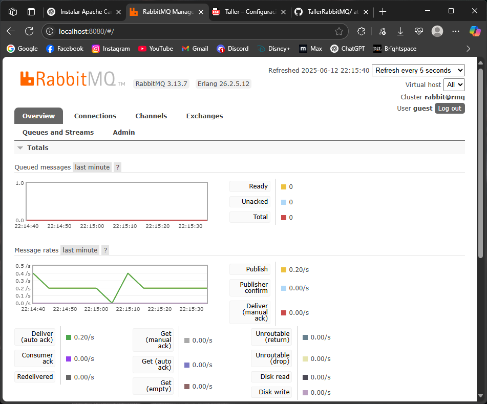

# Capturas de Pantalla 

## Consola de RabbitMQ mostrando la cola. 

## Consola de logs de Camel (productor y consumidor funcionando). 

# Informe Taller RabbitMQ con Apache Camel

## 1. Patrón de integración aplicado

En este taller se aplicó el **Patrón de Mensajería Asincrónica** (Asynchronous Messaging). Este patrón consiste en desacoplar el productor y el consumidor de mensajes mediante un intermediario (broker de mensajes), que en este caso es RabbitMQ.  
El productor envía mensajes a una cola gestionada por RabbitMQ, y el consumidor los recibe y procesa cuando está disponible, sin necesidad de que ambos estén conectados al mismo tiempo. Apache Camel facilita esta integración mediante rutas que conectan componentes de mensajería y temporizadores para generar y consumir mensajes.

---

## 2. Desacoplamiento entre productor y consumidor

El desacoplamiento se logró gracias a la intermediación del broker RabbitMQ, que actúa como un buffer temporal y gestor de la comunicación entre aplicaciones.  
- El **productor** publica mensajes periódicamente en la cola `test.camel.queue`.  
- El **consumidor** se suscribe a esa cola y procesa mensajes en cuanto están disponibles.  

Gracias a este diseño:  
- El productor no depende del estado ni de la disponibilidad del consumidor para enviar mensajes.  
- El consumidor puede procesar mensajes a su propio ritmo, garantizando la entrega confiable.  
- Se evita la dependencia directa entre aplicaciones, lo que facilita la escalabilidad y mantenimiento.

---

## 3. Ventajas observadas durante la práctica

- **Desacoplamiento claro:** Las aplicaciones productora y consumidora están independientes, lo que mejora la modularidad y reduce el acoplamiento fuerte.  
- **Fiabilidad y resiliencia:** RabbitMQ asegura que los mensajes se almacenan hasta que son consumidos, evitando pérdidas por fallos temporales.  
- **Flexibilidad en el procesamiento:** El consumidor puede pausarse o escalar sin afectar al productor, y viceversa.  
- **Facilidad de monitoreo:** La consola de RabbitMQ permite visualizar colas, mensajes y estados, facilitando la administración.  
- **Uso de Apache Camel:** Simplifica la integración con rutas declarativas, haciendo el código legible y mantenible.  
- **Aprendizaje práctico:** Comprender el flujo real de mensajes y configuraciones necesarias para un sistema de mensajería basado en colas y exchanges.

---

*Este informe resume los conceptos clave y resultados del taller para la integración de RabbitMQ con Apache Camel, demostrando la implementación exitosa del patrón de mensajería asincrónica y sus beneficios para sistemas distribuidos.*
